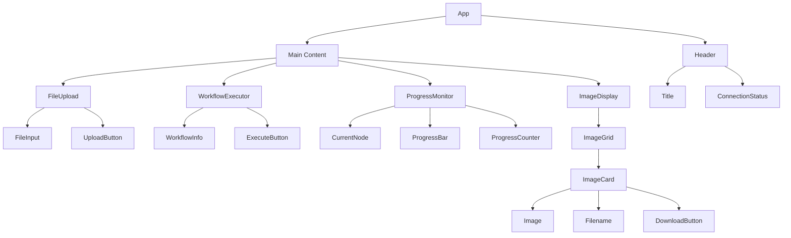
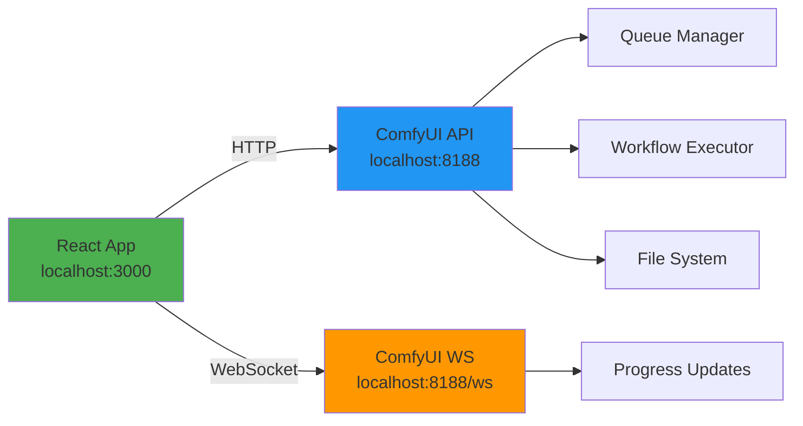
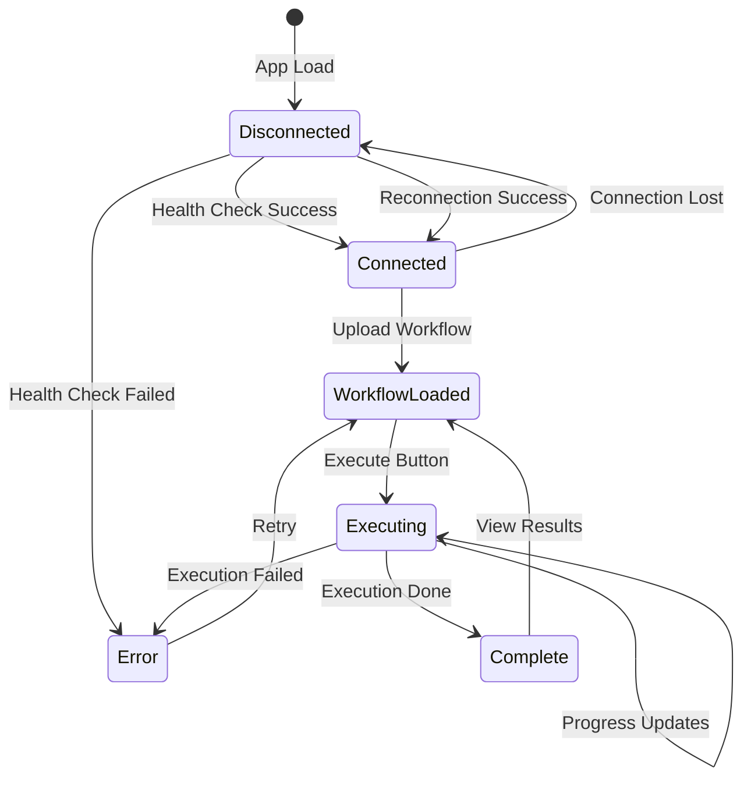

<!-- TINS Specification v1.0 -->
<!-- ZS:COMPLEXITY:MEDIUM -->
<!-- ZS:PRIORITY:HIGH -->
<!-- ZS:PLATFORM:WEB -->
<!-- ZS:LANGUAGE:TYPESCRIPT -->

# ComfyUI Workflow Runner

## Description

ComfyUI Workflow Runner is a modern web application that provides a user-friendly interface for executing ComfyUI AI workflows. The application connects to a local ComfyUI instance, allowing users to upload workflow JSON files, execute them, and monitor their progress in real-time through WebSocket connections. Generated images are displayed and can be downloaded directly from the interface.

The application implements the complete ComfyUI API specification, supporting all 40+ endpoints including queue management, history tracking, node discovery, file operations, and user data management. It provides real-time progress monitoring via WebSocket, showing current node execution status and progress percentages during workflow processing.

Built with React, TypeScript, and Vite, the application features a modern, responsive UI using shadcn/ui components and Tailwind CSS, ensuring type safety throughout and providing a seamless user experience for ComfyUI workflow execution.

## Functionality

### Core Features

#### 1. Workflow Upload and Management
- **File Upload Interface**: Drag-and-drop or click-to-browse file selection for ComfyUI API format JSON workflows
- **Workflow Validation**: Automatic validation of uploaded JSON structure to ensure compatibility
- **Workflow Information Display**: Shows workflow filename and node count after successful upload
- **Error Handling**: Clear error messages for invalid JSON or malformed workflow files

#### 2. Connection Management
- **Real-time Connection Status**: Visual indicator (🟢 Connected / 🔴 Disconnected) in the header
- **Health Check**: Automatic health check on application load to verify ComfyUI accessibility
- **WebSocket Connection**: Establishes persistent WebSocket connection for real-time updates
- **Auto-reconnection**: Automatic reconnection attempts (up to 5 times) if WebSocket connection drops
- **CORS Compatibility**: Properly configured to work with ComfyUI's CORS requirements

#### 3. Workflow Execution
- **Execute Button**: Single-click workflow execution with visual feedback
- **Queue Submission**: Submits workflows to ComfyUI's execution queue with unique client ID
- **Execution Status Display**: Shows current execution state (idle/executing/error)
- **Queue Position**: Displays workflow position in execution queue
- **Interrupt Capability**: Ability to stop current workflow execution

#### 4. Real-time Progress Monitoring
- **Current Node Display**: Shows which node is currently being executed
- **Progress Bar**: Visual progress indicator showing completion percentage
- **Progress Counter**: Numeric display (e.g., "15 / 20 steps")
- **Execution Time**: Tracks and displays execution duration
- **Live Updates**: Real-time updates via WebSocket as workflow progresses

#### 5. Image Display and Management
- **Image Grid**: Responsive grid layout displaying all generated images
- **Image Preview**: Full-resolution image display with proper aspect ratio
- **Filename Display**: Shows original ComfyUI-generated filename
- **Download Function**: Individual download button for each image
- **Batch Download**: Optional ability to download all images at once

#### 6. Error Handling and Feedback
- **Connection Errors**: Clear messages when ComfyUI is not accessible
- **Validation Errors**: Specific error messages for workflow validation failures
- **Execution Errors**: Display of execution errors with node information
- **Network Errors**: Handling of network failures with retry options
- **CORS Errors**: Specific guidance for CORS configuration issues

### User Interface

#### Layout Structure

```
┌─────────────────────────────────────────────────────┐
│ Header                                               │
│ - Title: "ComfyUI Workflow Runner"                  │
│ - Status: 🟢 Connected / 🔴 Disconnected           │
└─────────────────────────────────────────────────────┘
│                                                      │
│ ┌─────────────────────────────────────────────┐   │
│ │ Upload Workflow JSON                        │   │
│ │ [Upload Button]                             │   │
│ └─────────────────────────────────────────────┘   │
│                                                      │
│ ┌─────────────────────────────────────────────┐   │
│ │ Loaded Workflow                             │   │
│ │ File: workflow_name.json                    │   │
│ │ Nodes: 12                                   │   │
│ │ [Execute Workflow Button]                   │   │
│ └─────────────────────────────────────────────┘   │
│                                                      │
│ ┌─────────────────────────────────────────────┐   │
│ │ Execution Status                            │   │
│ │ Current Node: KSampler                      │   │
│ │ Progress: [████████░░] 80%                  │   │
│ │ Steps: 16 / 20                              │   │
│ └─────────────────────────────────────────────┘   │
│                                                      │
│ ┌─────────────────────────────────────────────┐   │
│ │ Generated Images (3)                        │   │
│ │ ┌─────┐ ┌─────┐ ┌─────┐                    │   │
│ │ │ Img │ │ Img │ │ Img │                    │   │
│ │ │  1  │ │  2  │ │  3  │                    │   │
│ │ └─────┘ └─────┘ └─────┘                    │   │
│ │ [Download] [Download] [Download]            │   │
│ └─────────────────────────────────────────────┘   │
│                                                      │
└─────────────────────────────────────────────────────┘
```

#### Component Hierarchy



### Behavior Specifications

#### Application Startup
1. Load application at `http://localhost:3000`
2. Initialize ComfyUI service with unique client ID
3. Perform health check against `http://localhost:8188/system_stats`
4. If health check succeeds:
   - Establish WebSocket connection to `ws://localhost:8188/ws?clientId={clientId}`
   - Display "🟢 Connected" status
5. If health check fails:
   - Display "🔴 Disconnected" status
   - Show error message with instructions

#### Workflow Upload Flow
1. User clicks "Upload Workflow JSON" button
2. File picker opens (accepts .json files only)
3. User selects workflow file
4. Application reads file content
5. Parse JSON and validate structure:
   - Must be valid JSON object
   - Must contain workflow nodes with `class_type` and `inputs` properties
6. If validation succeeds:
   - Display workflow filename
   - Display node count
   - Enable "Execute Workflow" button
   - Store workflow in state
7. If validation fails:
   - Display error alert with specific error message
   - Reset file input
   - Keep "Execute Workflow" button disabled

#### Workflow Execution Flow
1. User clicks "Execute Workflow" button
2. Disable upload and execute buttons
3. Clear previous execution status and images
4. Send POST request to `/prompt` with:
   ```json
   {
     "prompt": workflowObject,
     "client_id": uniqueClientId
   }
   ```
5. Receive response with `prompt_id` and queue `number`
6. Store `prompt_id` for tracking
7. WebSocket messages update execution status:
   - `execution_start`: Mark as executing
   - `executing`: Update current node
   - `progress`: Update progress bar
   - `executed`: Node completed
   - When node is null: Execution complete
8. On completion:
   - Fetch history from `/history/{prompt_id}`
   - Extract images from outputs
   - Display images in grid
   - Re-enable buttons

#### WebSocket Message Handling
- **Status Messages**: Update overall system status
- **Execution Start**: `{type: 'execution_start', data: {prompt_id}}`
- **Node Executing**: `{type: 'executing', data: {node: 'NodeName', prompt_id}}`
- **Progress Update**: `{type: 'progress', data: {value: 15, max: 20}}`
- **Execution Complete**: `{type: 'executing', data: {node: null}}`
- **Execution Error**: `{type: 'execution_error', data: {...}}`

#### Error Recovery
1. **Connection Lost**: Attempt reconnection every 2 seconds, up to 5 attempts
2. **Execution Error**: Display error message, allow re-execution
3. **Invalid Workflow**: Clear workflow, prompt for new upload
4. **CORS Error**: Display specific CORS configuration instructions

## Technical Implementation

### Architecture

#### System Architecture



#### Application Structure

```
src/
├── components/
│   ├── FileUpload.tsx           # Workflow file upload
│   ├── WorkflowExecutor.tsx     # Execution control
│   ├── ProgressMonitor.tsx      # Progress display
│   ├── ImageDisplay.tsx         # Image grid and download
│   └── ui/                      # shadcn/ui components
├── services/
│   ├── comfyui.service.ts       # ComfyUI API client
│   └── websocket.service.ts     # WebSocket management
├── types/
│   └── comfyui.types.ts         # TypeScript definitions
├── lib/
│   └── utils.ts                 # Utility functions
└── App.tsx                      # Main application
```

### Data Structures

#### Workflow Structure

```typescript
interface WorkflowNode {
  inputs: Record<string, any>;
  class_type: string;
  _meta?: {
    title?: string;
  };
}

interface Workflow {
  [nodeId: string]: WorkflowNode;
}
```

**Example**:
```json
{
  "3": {
    "inputs": {
      "seed": 123456,
      "steps": 20,
      "cfg": 8,
      "sampler_name": "euler",
      "scheduler": "normal",
      "denoise": 1,
      "model": ["4", 0],
      "positive": ["6", 0],
      "negative": ["7", 0],
      "latent_image": ["5", 0]
    },
    "class_type": "KSampler"
  },
  "4": {
    "inputs": {
      "ckpt_name": "model.safetensors"
    },
    "class_type": "CheckpointLoaderSimple"
  }
}
```

#### API Request/Response Types

```typescript
// Prompt submission
interface PromptRequest {
  prompt: Workflow;
  client_id: string;
}

interface PromptResponse {
  prompt_id: string;
  number: number;
  node_errors?: Record<string, any>;
}

// Queue management
interface QueueStatusResponse {
  exec_info: {
    queue_remaining: number;
  };
}

interface QueueItem {
  [0]: number;           // queue position
  [1]: string;          // prompt_id
  [2]: Workflow;        // prompt
  [3]: { client_id: string };
  [4]: string[];        // outputs
}

interface QueueResponse {
  queue_running: QueueItem[];
  queue_pending: QueueItem[];
}

// History tracking
interface HistoryResponse {
  [promptId: string]: {
    prompt: [number, string, Workflow];
    outputs: Record<string, NodeOutput>;
    status: {
      status_str: string;
      completed: boolean;
      messages: any[];
    };
  };
}

interface NodeOutput {
  images?: ImageOutput[];
  [key: string]: any;
}

interface ImageOutput {
  filename: string;
  subfolder: string;
  type: string;
}
```

#### WebSocket Messages

```typescript
interface WSMessage {
  type: 'status' | 'progress' | 'executing' | 'executed' | 
        'execution_start' | 'execution_cached' | 'execution_error';
  data: {
    node?: string | null;
    value?: number;
    max?: number;
    prompt_id?: string;
    status?: any;
    sid?: string;
  };
}
```

#### Application State

```typescript
interface ExecutionStatus {
  isExecuting: boolean;
  currentNode: string | null;
  progress: number;
  maxProgress: number;
  error: string | null;
}
```

### Algorithms

#### Client ID Generation

```typescript
function generateClientId(): string {
  const timestamp = Date.now();
  const random = Math.random().toString(36).substr(2, 9);
  return `client_${timestamp}_${random}`;
}
```

#### Image Extraction from History

```typescript
function extractImages(history: HistoryResponse, promptId: string): ImageOutput[] {
  const images: ImageOutput[] = [];
  const promptHistory = history[promptId];
  
  if (!promptHistory?.outputs) {
    return images;
  }
  
  Object.values(promptHistory.outputs).forEach(nodeOutput => {
    if (nodeOutput.images) {
      images.push(...nodeOutput.images);
    }
  });
  
  return images;
}
```

#### WebSocket Reconnection Logic

```typescript
class WebSocketService {
  private reconnectAttempts = 0;
  private maxReconnectAttempts = 5;
  private reconnectDelay = 2000;
  
  private handleReconnect(): void {
    if (this.reconnectAttempts < this.maxReconnectAttempts) {
      this.reconnectAttempts++;
      console.log(`Reconnecting (${this.reconnectAttempts}/${this.maxReconnectAttempts})...`);
      
      setTimeout(() => {
        this.connect().catch(console.error);
      }, this.reconnectDelay);
    } else {
      console.error('Max reconnection attempts reached');
    }
  }
}
```

### Service Layer Implementation

#### ComfyUI Service

The `ComfyUIService` class provides methods for all ComfyUI API endpoints:

**Core Execution & Queue Management**:
- `queuePrompt(workflow)` - POST /prompt
- `getQueueStatus()` - GET /prompt
- `getQueue()` - GET /queue
- `manageQueue(request)` - POST /queue
- `interrupt()` - POST /interrupt

**History Management**:
- `getAllHistory()` - GET /history
- `getHistory(promptId)` - GET /history/{prompt_id}
- `manageHistory(request)` - POST /history

**Node & Model Discovery**:
- `getObjectInfo()` - GET /object_info
- `getNodeInfo(nodeClass)` - GET /object_info/{node_class}
- `getModels()` - GET /models
- `getModelsInFolder(folder)` - GET /models/{folder}
- `getFeatures()` - GET /features
- `getSystemStats()` - GET /system_stats
- `getEmbeddings()` - GET /embeddings
- `getExtensions()` - GET /extensions
- `getWorkflowTemplates()` - GET /workflow_templates
- `getModelMetadata(folderName)` - GET /view_metadata/{folder_name}

**File Operations**:
- `uploadImage(file, options)` - POST /upload/image
- `uploadMask(file, options)` - POST /upload/mask
- `getImageUrl(image)` - Constructs /view URL
- `downloadImage(image)` - Downloads image as Blob

**User Data Management**:
- `listUserData(directory)` - GET /userdata
- `listUserDataV2(directory)` - GET /v2/userdata
- `getUserDataFile(filePath)` - GET /userdata/{file}
- `uploadUserDataFile(filePath, file)` - POST /userdata/{file}
- `deleteUserDataFile(filePath)` - DELETE /userdata/{file}
- `moveUserDataFile(source, dest)` - POST /userdata/{file}/move/{dest}

**User Management**:
- `getUserInfo()` - GET /users
- `createUser(username)` - POST /users

**Memory Management**:
- `freeMemory(request)` - POST /free

**Utilities**:
- `extractImages(history, promptId)` - Extract images from history
- `healthCheck()` - Check ComfyUI accessibility

#### WebSocket Service

The `WebSocketService` class manages real-time communication:

```typescript
class WebSocketService {
  private ws: WebSocket | null = null;
  private clientId: string;
  private messageHandlers: Set<(message: WSMessage) => void> = new Set();
  
  constructor(clientId: string) {
    this.clientId = clientId;
  }
  
  connect(): Promise<void> {
    return new Promise((resolve, reject) => {
      const url = `ws://localhost:8188/ws?clientId=${this.clientId}`;
      this.ws = new WebSocket(url);
      
      this.ws.onopen = () => {
        this.reconnectAttempts = 0;
        resolve();
      };
      
      this.ws.onmessage = (event) => {
        const message: WSMessage = JSON.parse(event.data);
        this.messageHandlers.forEach(handler => handler(message));
      };
      
      this.ws.onerror = (error) => reject(error);
      this.ws.onclose = () => this.handleReconnect();
    });
  }
  
  subscribe(handler: (message: WSMessage) => void): () => void {
    this.messageHandlers.add(handler);
    return () => this.messageHandlers.delete(handler);
  }
  
  disconnect(): void {
    if (this.ws) {
      this.ws.close();
      this.ws = null;
    }
    this.messageHandlers.clear();
  }
}
```

### Component Implementation

#### FileUpload Component

```typescript
interface FileUploadProps {
  onWorkflowLoaded: (workflow: Workflow, filename: string) => void;
  disabled?: boolean;
}

const FileUpload: React.FC<FileUploadProps> = ({ onWorkflowLoaded, disabled }) => {
  const fileInputRef = useRef<HTMLInputElement>(null);
  
  const handleFileChange = async (event: ChangeEvent<HTMLInputElement>) => {
    const file = event.target.files?.[0];
    if (!file) return;
    
    try {
      const text = await file.text();
      const workflow: Workflow = JSON.parse(text);
      
      // Validation
      if (typeof workflow !== 'object' || workflow === null) {
        throw new Error('Invalid workflow format');
      }
      
      onWorkflowLoaded(workflow, file.name);
    } catch (error) {
      alert(`Failed to load workflow: ${error.message}`);
    }
    
    // Reset input
    if (fileInputRef.current) {
      fileInputRef.current.value = '';
    }
  };
  
  return (
    <div>
      <input
        ref={fileInputRef}
        type="file"
        accept=".json"
        onChange={handleFileChange}
        style={{ display: 'none' }}
        disabled={disabled}
      />
      <button onClick={() => fileInputRef.current?.click()} disabled={disabled}>
        Upload Workflow JSON
      </button>
    </div>
  );
};
```

#### ProgressMonitor Component

```typescript
interface ProgressMonitorProps {
  status: ExecutionStatus;
}

const ProgressMonitor: React.FC<ProgressMonitorProps> = ({ status }) => {
  if (!status.isExecuting && !status.error) return null;
  
  const progressPercentage = status.maxProgress > 0 
    ? Math.round((status.progress / status.maxProgress) * 100)
    : 0;
  
  return (
    <div className="progress-monitor">
      <h3>Execution Status</h3>
      
      {status.error ? (
        <div className="error">{status.error}</div>
      ) : (
        <>
          {status.currentNode && (
            <p>Current Node: {status.currentNode}</p>
          )}
          
          {status.maxProgress > 0 && (
            <div className="progress-container">
              <div className="progress-bar" style={{ width: `${progressPercentage}%` }}>
                {progressPercentage}%
              </div>
              <p>Progress: {status.progress} / {status.maxProgress}</p>
            </div>
          )}
        </>
      )}
    </div>
  );
};
```

### State Management

#### Application State Flow



#### React State Management

```typescript
function App() {
  // Services
  const [comfyService] = useState(() => new ComfyUIService());
  const [wsService, setWsService] = useState<WebSocketService | null>(null);
  
  // Connection state
  const [isConnected, setIsConnected] = useState(false);
  
  // Workflow state
  const [workflow, setWorkflow] = useState<Workflow | null>(null);
  const [workflowName, setWorkflowName] = useState<string>('');
  
  // Execution state
  const [executionStatus, setExecutionStatus] = useState<ExecutionStatus>({
    isExecuting: false,
    currentNode: null,
    progress: 0,
    maxProgress: 0,
    error: null
  });
  
  // Results state
  const [images, setImages] = useState<ImageOutput[]>([]);
  const [currentPromptId, setCurrentPromptId] = useState<string | null>(null);
  
  // ... implementation
}
```

## Style Guide

### Design System

#### Color Palette

```css
:root {
  /* Primary colors */
  --primary: #007bff;
  --primary-hover: #0056b3;
  
  /* Status colors */
  --success: #28a745;
  --error: #dc3545;
  --warning: #ffc107;
  --info: #17a2b8;
  
  /* Background colors */
  --bg-primary: #ffffff;
  --bg-secondary: #f5f5f5;
  --bg-dark: #282c34;
  
  /* Text colors */
  --text-primary: #333333;
  --text-secondary: #666666;
  --text-light: #ffffff;
  
  /* Border colors */
  --border-color: #dddddd;
  --border-radius: 4px;
}
```

#### Typography

- **Font Family**: `-apple-system, BlinkMacSystemFont, 'Segoe UI', 'Roboto', 'Oxygen', 'Ubuntu', 'Cantarell', 'Fira Sans', 'Droid Sans', 'Helvetica Neue', sans-serif`
- **Headers**: 
  - H1: 32px, bold
  - H2: 24px, bold
  - H3: 20px, bold
- **Body**: 16px, regular
- **Small**: 14px, regular
- **Caption**: 12px, regular

#### Spacing

```css
--spacing-xs: 4px;
--spacing-sm: 8px;
--spacing-md: 16px;
--spacing-lg: 24px;
--spacing-xl: 32px;
```

#### Component Styling

**Buttons**:
```css
button {
  padding: 12px 24px;
  font-size: 16px;
  border-radius: 4px;
  border: none;
  cursor: pointer;
  transition: opacity 0.2s;
}

button:hover:not(:disabled) {
  opacity: 0.9;
}

button:disabled {
  cursor: not-allowed;
  background-color: #cccccc;
}

/* Primary button */
.button-primary {
  background-color: #007bff;
  color: white;
}

/* Success button */
.button-success {
  background-color: #28a745;
  color: white;
}
```

**Cards**:
```css
.card {
  padding: 15px;
  border: 1px solid #ddd;
  border-radius: 4px;
  margin-bottom: 20px;
  background-color: white;
}
```

**Progress Bar**:
```css
.progress-container {
  width: 100%;
  background-color: #e0e0e0;
  border-radius: 4px;
  overflow: hidden;
}

.progress-bar {
  height: 24px;
  background-color: #28a745;
  transition: width 0.3s ease;
  display: flex;
  align-items: center;
  justify-content: center;
  color: white;
  font-size: 12px;
}
```

#### Responsive Design

- **Mobile**: < 640px
- **Tablet**: 640px - 1024px
- **Desktop**: > 1024px

```css
/* Image grid responsive */
.image-grid {
  display: grid;
  grid-template-columns: repeat(auto-fill, minmax(300px, 1fr));
  gap: 20px;
}

@media (max-width: 640px) {
  .image-grid {
    grid-template-columns: 1fr;
  }
}
```

#### Animation

```css
/* Fade in animation */
@keyframes fadeIn {
  from { opacity: 0; }
  to { opacity: 1; }
}

.fade-in {
  animation: fadeIn 0.3s ease-in;
}

/* Progress bar animation */
.progress-bar {
  transition: width 0.3s ease;
}

/* Button hover */
button {
  transition: opacity 0.2s, transform 0.1s;
}

button:active {
  transform: scale(0.98);
}
```

## Testing Scenarios

### Connection Testing

#### Test 1: Successful Connection
**Given**: ComfyUI is running with CORS enabled
**When**: Application loads
**Then**: 
- Health check succeeds
- WebSocket connects
- Status shows "🟢 Connected"
- No error messages

#### Test 2: ComfyUI Not Running
**Given**: ComfyUI is not running
**When**: Application loads
**Then**:
- Health check fails
- Status shows "🔴 Disconnected"
- Error message: "ComfyUI is not accessible at http://localhost:8188"

#### Test 3: CORS Misconfiguration
**Given**: ComfyUI running without proper CORS
**When**: Application tries to connect
**Then**:
- CORS error in browser console
- Connection fails
- Instructions displayed for CORS configuration

### Workflow Upload Testing

#### Test 4: Valid Workflow Upload
**Given**: User has valid workflow JSON file
**When**: User uploads file
**Then**:
- File loads successfully
- Filename displayed
- Node count displayed
- Execute button enabled

#### Test 5: Invalid JSON Upload
**Given**: User has invalid JSON file
**When**: User uploads file
**Then**:
- Error alert displays
- Specific error message shown
- File input resets
- Execute button stays disabled

#### Test 6: Non-Workflow JSON Upload
**Given**: User uploads valid JSON but not a workflow
**When**: Validation runs
**Then**:
- Error: "Invalid workflow format"
- Workflow not loaded
- Execute button disabled

### Execution Testing

#### Test 7: Successful Workflow Execution
**Given**: Valid workflow loaded and connected
**When**: User clicks Execute
**Then**:
- Workflow submitted to queue
- Progress updates received
- Images displayed when complete
- Buttons re-enabled

#### Test 8: Execution with Progress
**Given**: Workflow executing
**When**: Progress updates received via WebSocket
**Then**:
- Current node updates
- Progress bar advances
- Percentage updates
- Counter updates (e.g., "15 / 20")

#### Test 9: Execution Error
**Given**: Workflow has error (e.g., missing model)
**When**: Execution fails
**Then**:
- Error message displayed
- Execution stops
- Buttons re-enabled
- User can retry

### WebSocket Testing

#### Test 10: Connection Drop and Reconnect
**Given**: WebSocket connected
**When**: Connection drops
**Then**:
- Automatic reconnection attempts (up to 5)
- 2-second delay between attempts
- Success message on reconnection
- Failure message after max attempts

#### Test 11: Message Handling
**Given**: Workflow executing
**When**: Various WebSocket messages received
**Then**:
- `execution_start`: Execution begins
- `executing`: Node name updates
- `progress`: Progress bar updates
- Node `null`: Execution complete, fetch results

### Image Display Testing

#### Test 12: Single Image Display
**Given**: Workflow generates 1 image
**When**: Execution completes
**Then**:
- Image displays in grid
- Filename shown
- Download button present
- Image loads at full resolution

#### Test 13: Multiple Images Display
**Given**: Workflow generates multiple images
**When**: Execution completes
**Then**:
- All images display in responsive grid
- Each image has filename and download
- Grid adjusts to screen size

#### Test 14: Image Download
**Given**: Images displayed
**When**: User clicks download button
**Then**:
- Image downloads with original filename
- Browser download initiated
- No errors in console

## Configuration Requirements

### Environment Configuration

```typescript
// vite.config.ts
export default defineConfig({
  server: {
    host: "::",
    port: 3000,  // Must match CORS configuration
  },
  plugins: [react()],
  resolve: {
    alias: {
      "@": path.resolve(__dirname, "./src"),
    },
  },
});
```

### API Endpoints Configuration

```typescript
// src/services/comfyui.service.ts
const COMFYUI_BASE_URL = 'http://localhost:8188';

// src/services/websocket.service.ts
const COMFYUI_WS_URL = 'ws://localhost:8188/ws';
```

**Critical Configuration Rules**:
1. Application port must match ComfyUI CORS origin
2. Use `localhost` consistently (not `127.0.0.1`)
3. ComfyUI must be started with: `--enable-cors-header http://localhost:3000`

### CORS Configuration

**ComfyUI Startup Commands**:

```bash
# Standard Installation
python main.py --enable-cors-header http://localhost:3000

# Windows Standalone Build
.\python_embeded\python.exe -s ComfyUI\main.py --windows-standalone-build --listen 0.0.0.0 --enable-cors-header http://localhost:3000
```

**Port Matching Requirements**:
- If app runs on port 3000: `--enable-cors-header http://localhost:3000`
- If app runs on port 8080: `--enable-cors-header http://localhost:8080`
- Origin must match exactly (including protocol and port)

## Performance Goals

### Response Time Targets
- Initial page load: < 2 seconds
- Workflow upload and validation: < 500ms
- API requests: < 1 second
- WebSocket connection establishment: < 1 second
- Image loading: < 2 seconds per image

### Real-time Updates
- WebSocket messages processed within 50ms
- Progress bar updates: 30fps (smooth animation)
- UI updates: No blocking on main thread

### Resource Efficiency
- Memory usage: < 100MB baseline
- CPU usage: Minimal when idle
- Network: Efficient use of WebSocket (no polling)

## Accessibility Requirements

### Keyboard Navigation
- All interactive elements accessible via Tab key
- Enter/Space to activate buttons
- Escape to close modals/dialogs
- Logical tab order through interface

### Screen Reader Support
- Semantic HTML elements (button, header, main, etc.)
- ARIA labels for icon-only buttons
- Status announcements for connection changes
- Progress updates announced
- Error messages announced

### Visual Accessibility
- Color contrast ratio ≥ 4.5:1 for text
- Focus indicators visible on all interactive elements
- No information conveyed by color alone
- Text resizable up to 200%

### Error Messaging
- Clear, descriptive error messages
- Specific guidance for resolution
- No technical jargon for user-facing errors

## Extended Features

### Future Enhancements

#### 1. Workflow Parameter Editor
- Visual editor for common parameters (seed, steps, CFG)
- Text prompt editing before execution
- Parameter presets and templates

#### 2. Batch Processing
- Execute same workflow multiple times with different seeds
- Queue multiple different workflows
- Batch parameter variation

#### 3. Workflow History
- Local storage of executed workflows
- History browsing and re-execution
- Execution time tracking
- Success/failure statistics

#### 4. Advanced Queue Management
- View all items in queue
- Reorder queue items
- Cancel specific queue items
- Queue priority levels

#### 5. Image Management
- Batch download as ZIP
- Image comparison view
- Favorite/star images
- Image metadata display
- Export with settings

#### 6. Workflow Library
- Save favorite workflows locally
- Tag and categorize workflows
- Search workflow library
- Import/export workflow collections

#### 7. Settings Panel
- Configure API endpoint
- Adjust UI theme (light/dark)
- Set default execution options
- Configure auto-save preferences

#### 8. Advanced Monitoring
- Execution time estimates
- VRAM usage display
- Node execution times
- Performance metrics

## Dependencies

### Required Dependencies

```json
{
  "dependencies": {
    "react": "^18.3.1",
    "react-dom": "^18.3.1",
    "react-router-dom": "^6.30.1"
  },
  "devDependencies": {
    "@types/node": "^22.16.5",
    "@types/react": "^18.3.23",
    "@types/react-dom": "^18.3.7",
    "@vitejs/plugin-react-swc": "^3.11.0",
    "typescript": "^5.8.3",
    "vite": "^5.4.19"
  }
}
```

### Optional UI Dependencies

```json
{
  "dependencies": {
    "@radix-ui/react-progress": "^1.1.7",
    "@radix-ui/react-dialog": "^1.1.14",
    "@radix-ui/react-toast": "^1.2.14",
    "class-variance-authority": "^0.7.1",
    "clsx": "^2.1.1",
    "tailwind-merge": "^2.6.0",
    "tailwindcss-animate": "^1.0.7"
  }
}
```

## Build and Deployment

### Development Build

```bash
npm install
npm run dev
```

Application runs at `http://localhost:3000`

### Production Build

```bash
npm run build
```

Output directory: `dist/`

### Build Configuration

```typescript
// vite.config.ts
export default defineConfig({
  build: {
    target: 'es2020',
    outDir: 'dist',
    sourcemap: false,
    minify: 'esbuild',
    rollupOptions: {
      output: {
        manualChunks: {
          'react-vendor': ['react', 'react-dom'],
          'ui-vendor': ['@radix-ui/react-progress', '@radix-ui/react-dialog']
        }
      }
    }
  }
});
```

## Security Considerations

### API Security
- No authentication required (local ComfyUI instance)
- CORS properly configured
- No sensitive data stored in application

### File Upload Security
- Only JSON files accepted
- File size limits enforced (max 10MB)
- JSON validation before processing
- No arbitrary code execution

### WebSocket Security
- Connection limited to localhost
- Client ID generated securely
- No sensitive data transmitted
- Automatic disconnection on errors

### Data Privacy
- No data sent to external servers
- All processing local
- No analytics or tracking
- User data stays on local machine

## Validation Rules

### Workflow Validation
1. Must be valid JSON
2. Must be an object (not array or primitive)
3. Must contain at least one node
4. Each node must have `class_type` property
5. Each node must have `inputs` object
6. Node IDs must be strings

### Input Validation
- File must be .json extension
- File size < 10MB
- JSON must parse without errors
- Workflow structure must be valid

### State Validation
- Cannot execute without connected ComfyUI
- Cannot execute without loaded workflow
- Cannot upload while executing
- Cannot execute while already executing

## Error Handling

### Error Types and Responses

#### Connection Errors
```typescript
{
  type: 'connection',
  message: 'ComfyUI is not accessible at http://localhost:8188',
  action: 'Verify ComfyUI is running with CORS enabled',
  retryable: true
}
```

#### Validation Errors
```typescript
{
  type: 'validation',
  message: 'Invalid workflow format: missing class_type in node 3',
  action: 'Check workflow export from ComfyUI',
  retryable: false
}
```

#### Execution Errors
```typescript
{
  type: 'execution',
  message: 'Execution failed at node KSampler',
  details: node_errors,
  action: 'Check ComfyUI console for details',
  retryable: true
}
```

#### Network Errors
```typescript
{
  type: 'network',
  message: 'Network request failed',
  action: 'Check internet connection',
  retryable: true
}
```

## Implementation Notes

### Critical Implementation Points

1. **Client ID Uniqueness**: Must be unique per session for WebSocket tracking
2. **CORS Matching**: Application URL and CORS origin must match exactly
3. **WebSocket Lifecycle**: Proper connection/disconnection handling essential
4. **Image URL Construction**: Must include all query parameters (filename, subfolder, type)
5. **Error Recovery**: Graceful degradation when ComfyUI disconnects
6. **State Synchronization**: UI state must match actual execution state

### Best Practices

1. Use TypeScript strict mode for type safety
2. Implement proper error boundaries in React
3. Clean up WebSocket connections on unmount
4. Use React hooks correctly (useEffect dependencies)
5. Optimize re-renders with useMemo/useCallback
6. Handle loading states consistently
7. Provide user feedback for all actions
8. Test with various workflow types
9. Handle edge cases (empty results, large images, etc.)
10. Document all API interactions

### Common Pitfalls to Avoid

1. ❌ Using `127.0.0.1` when CORS configured for `localhost`
2. ❌ Port mismatch between app and CORS configuration
3. ❌ Not handling WebSocket disconnections
4. ❌ Assuming workflow execution always succeeds
5. ❌ Not validating workflow structure before submission
6. ❌ Memory leaks from unclosed WebSocket connections
7. ❌ Not resetting state between executions
8. ❌ Hardcoding paths instead of using path construction
9. ❌ Not providing user feedback during operations
10. ❌ Ignoring TypeScript errors

---

**Document Version**: 1.0
**Last Updated**: January 2025
**Target Platform**: Web (React + TypeScript)
**Minimum Browser**: Chrome 90+, Firefox 88+, Safari 14+, Edge 90+
